# Работа с гит (Git) и гитхаб (GitHub)

## 1. Проверка наличия установленного Git

В терминале выполнить команду `git --version`.
 Если Git установлен появится сообщение с информацией о версии программы. Иначе будет сообщение об ошибке.

## 2. Установка Git 

Загружаем последнюю версию Git с [сайта](https://git-scm.com/downloads). И устанавливаем с настройками по умолчанию.

## 3. Настройка Git

При первом использовании Git необходимо представиться.
Для этого нужно ввести в терминале 2 команды:
```
git config --global user.name «Ваше имя английскими буквами»
git config --global user.email ваша почта@example.com
```

## 4. Инициализация репозитория

Чтобы инициализировать Git в нужной папке:

1. Откройте папку в Visual Studio Code. Для этого нужно на верхней панели выберите `файл -> открыть папку` или сочетаниями клавиш: `Ctrl + K` или `Ctrl + O`;
2. В терминале пропишите команду `git init`;
3. Если возникла ошибка, значит вы пропустили настройку Git. Вернитесь к разделу 3 - настройка Git.

## 5. Запись изменений в репозиторий

Есть несколько способов записи изменений, но прежде чем к ним перейти рассмотрим рекомендации и три небольших лайфхака к созданию коммитов:

* Желательно писать комментарии к коммитам на английском языке
* Комментарии должны излагать общее значение изменения файла, не нужно копипастить весь код который вы написали в терминал
* Не забывайте про пробелы и кавычки
* Не забывайте про сохранение файла перед записью изменений. Можно включить автосохранение (`файл -> автосохранение`), для ручного сохранения используйте комбинацию клавиш `Ctrl + S`
* Когда записываете имя файла можно нажать Tab после первых символов, имя само заполнится дальше (если в репозитории только один файл, то можно просто нажать Tab, не вводя первые символы)
* Если до этого вы вводили команду, которая вам нужна сейчас, то с помощью стрелок вверх и вниз вы можете найти нужную команду в памяти терминала
* Если вы хотите сохранить все файлы, то вместо `git add имя файла` напишите `git add .`

**Первый способ записи изменений**

Этим способом нужно пользоваться при первом сохранении и можно использовать при дальнейших. Для него нам нужны две команды: `git add имя файла` и `git commit -m "комментарий"`. Сначала прописываем команду `git add имя файла`, под именем файла понимается имя файла, который нужно сохранить и его расширение. Например, есть файл Pigeon.md, тогда команда будет выглядеть `git add Pigeon.md`. Дальше вводим `git commit -m "комментарий"`, комментарий может быть любым, но если вы работаете в команде или не хотите через пару дней пытаться понять себя из прошлого, то пишите кратко и понятно, лучше на английском языке.

Так будет выглядеть успешное сохранение первым способом в терминале:

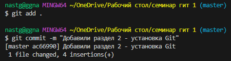

**Второй способ записи изменений**

Этим и следующим способами можно пользоваться при последующих сохранениях. Вводим команду `git commit -a`, после ввода терминал немного изменится. Далее на <u>Английской раскладке</u> клавиатуры вводим "I", после чего можно вводить комментарий. Когда вы закончили ввод нажмите esc, переключитесь на <u>Английскую раскладку</u> клавиатуры и введите ":" (буква Ж на русской раскладке), после этого снизу терминала появится поле для ввода, напишите туда "wq" и нажмите enter.

Так будет выглядеть успешное сохранение вторым способом в терминале:

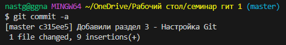

Терминал до ввода комментария:

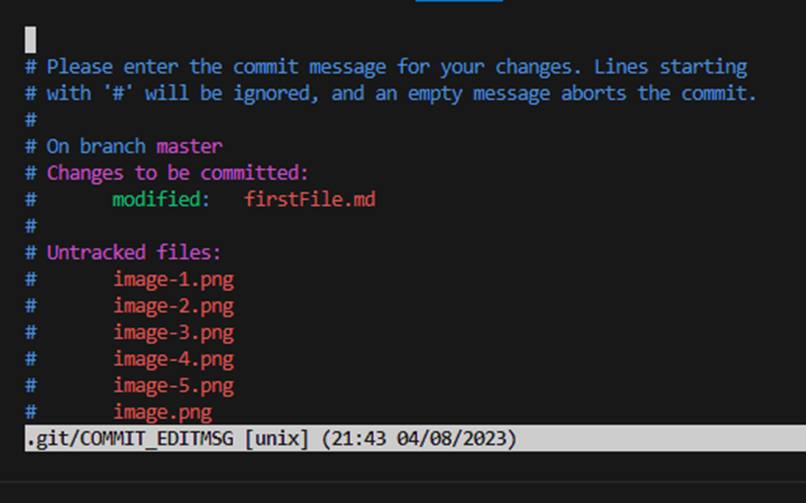

Терминал во время ввода комментария:

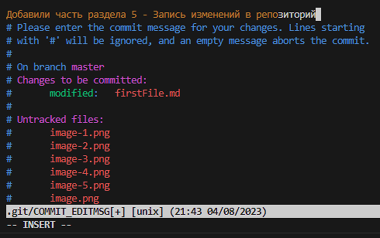

**Третий способ записи изменений**

Это самый быстрый способ, для него на выбор есть две команды: `git commit -a -m "комментарий"` или `git commit -am "комментарий"`.

Так будет выглядеть успешное сохранение третьим способом в терминале:

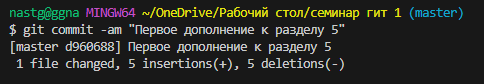

**Вспомогательные команды**

* `git status` - показывает текущее состояние Git, есть ли изменения в файлах, добавленных в репозиторий. 

    Вывод `git status`, когда есть изменённые и не добавленные файлы:

    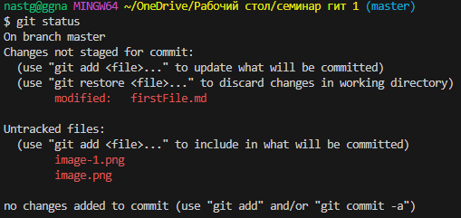

    Вывод `git status`, когда нужно сделать коммит (если написать git status между `git add имя файла` и `git commit -m "комментарий"`):

    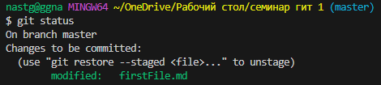

    Вывод `git status`, когда всё отслеживается и сохранено:

    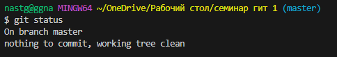

* `git diff`- проверка разницы между текущим состоянием файла и последним коммитом в репозитории. При изменении строчки Git будет считать её удалённой, на фотографии ниже я убрала из строчки "Так будет выглядеть успешное сохранение третьим способом в терминале:" слово "третьим", из-за этого изначальный вариант подсвечивается красным и перед  ним стоит минус, а под ним новый вариант строчки. И ещё я добавила картинку, поэтому есть ещё одна зелёная строчка.

    Вывод `git diff`:

    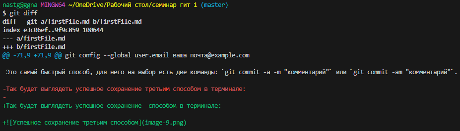

## 6. Просмотр истории коммитов

Команды для просмотра истории коммитов могут пригодиться, если вы хотите вернуться к старой версии вашей работы. На обычных сохранениях в Visual Studio вы далеко в прошлое не уйдёте, да и при выходе из студии вся история сбросится. Так что на помощь приходят две следующие команды Git'a:

* `git log` - просмотр всех коммитов. К каждому коммиту выводится идентификатор, автор, дата и время его создания и комментарий.

    Вывод `git log`:

    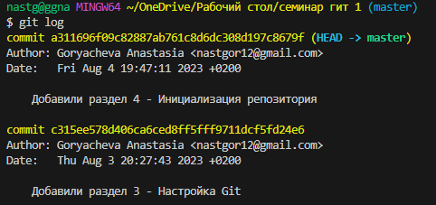

* `git log --oneline` - просмотр всех коммитов, но в сокращенном варианте (первые семь символов идентификатора и комментарий).

    Вывод `git log --oneline`:

    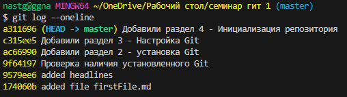

## 7. Перемещение между коммитами

Но зачем нам команды для просмотра истории? -Отчасти чтобы была возможность перемещаться между коммитами. Для перемещения есть две команды:

* `git checkout идентификатор` - переход к нужному коммиту. Не обязательно вводить весь идентификатор, достаточно первых четырёх чисел.

    Вывод `git checkout идентификатор` в терминал:

    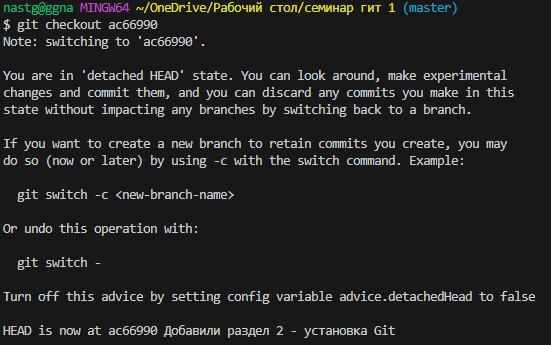

* `git checkout master` - переход к актуальному состоянию.

    Вывод `git checkout master` в терминал:

    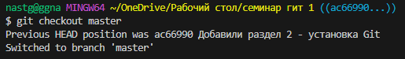

## 8. Игнорирование файлов

Для того, чтобы исключить из отслеживания в репозитории определённые файли или папки необходимо создать там файл ***.gitignore*** и записать в него их названия или шаблоны, соответствующие таким файлам или папкам. Например нужно игнорировать файлы с расширением ***.png***, шаблон для них будет выглюдеть так: *.png


## 9. Создание веток в Git

Для создания ветки можно воспользоваться двумя командами:

* `git branch <имя новой ветки>` - простое создание новой ветки.

    На фото ниже создана новая ветка и проверено, какие ветки есть в репозитории.

    
* `git checkout -b <имя новой ветки>` - создание новой ветки с переключением на неё.

    На фото создана новая ветка, после команды есть сообщение "Switched to a new branch 'resolveConflicts'", что переводится как "переключен на новую ветку 'resolveConflicts'"

    

По умолчанию имя основной ветки в Git - ***master***. 

`git branch` - просмотр списка веток в репозитории. Зелёным цветом и звёздочкой перед названием выделяется ветка, в которой вы сейчас находитесь.


## 10. Слияние веток и разрешение конфликтов

`git merge <имя ветки>` - слияние выбранной ветки с текущей.

Если была изменена одна и та же часть файла в обеих ветках, то может возникнуть конфликт, который потребует участия пользователя. VSCode предлагает варианты разрешения. Чтобы разрешить конфликт, нужно выбрать один из вариантов или объединить содержимое по-своему. Либо воспользоваться редактором слияния (есть только в новых версиях VSCode).

Сообщение при возникновении ошибки: 


Сообщение, если слияние прошло успешно:


## 11. Просмотр дерева (графа) коммитов, удаление веток

Чтобы посмотреть дерево репозитория нужно использовать команду `git log --graph`. Если веток несколько, то дерево будет выглядеть примерно так:


Если же параллельных веток (которые произошли от одного коммита) нет, то будет просто одна полоска. Пересечения обозначают момент, когда произошло слияние.

Для удаления ветки используется команда: `git branch -d <имя ветки>`. Если вы находитесь в ветке, которую у=пытаетесь удалить, то выйдет ошибка, перед удалением ветки нужно обязательно перейти на другую. Если вы уже перешли на другую ветку, но удалить всё равно не получается, значит вы не выполнили слияние той ветки с какой-либо другой. Если вам точно не нужен тот висящий коммит, то вы можете выполнить принудительное удаление ветки с помощью `git branch -D <имя ветки>`.

Обычное удаление ветки:


Ошибки при удалении ветки:

* Когда находитесь в той же ветке:

    

* Когда есть висящий коммит:

    

Принудительное удаление ветки:


Создание конфликта 3 (открыта ветка conflict)